<div align="center">



**Real-time kite & surf intelligence for the Israeli coast.**  
Wind · Waves · Cameras · Rain Radar · Forecasts

</div>

---

## What is GUSTON?

GUSTON is a surf and kite intelligence dashboard for the Israeli Mediterranean coast. One page. No fluff. Everything you need to decide whether to rig your kite or leave it in the bag.

The name came from two places — a small gust, and the idea of a precise, always-reliable wind butler. GUSTON knows the conditions before you do.

---

## Features

| | |
|---|---|
| **Go / No-Go indicator** | Live kite-readiness score with suggested kite size based on current wind |
| **Wind analysis** | Live Holfuy station data — speed, gusts, direction, Beaufort scale |
| **Wave conditions** | Height, period, swell direction via Open-Meteo Marine API |
| **Beach cameras** | Live feeds from Beit Yanai, Tel Aviv, Bat Yam, Herzliya, Sdot Yam |
| **Rain radar** | IMS ECMWF + COSMO model maps, auto-refresh |
| **Wind map** | Interactive Windy.com embed, ECMWF model, centered on Israel coast |
| **Forecasts** | WindGuru (96h + 240h) and MagicSeaweed for Israeli spots |
| **Beach filter** | Toggle by location — conditions data and feeds update per beach |

---

## Data Sources

All sources are Israel-specific. No US or global models applied to Israeli conditions.

- **[IMS](https://ims.gov.il)** — Israel Meteorological Service, rain forecast models (ECMWF, COSMO)
- **[Holfuy](https://www.holfuy.com)** — Wind station 846 (Beit Yanai), live wind + camera
- **[WindGuru](https://www.windguru.cz)** — Sdot Yam (910318) and Beit Yanai (895899) forecast spots
- **[MagicSeaweed](https://magicseaweed.com)** — Surf reports for Hazuk Beach and Beit Yanai
- **[wind.co.il](https://wind.co.il)** — Sdot Yam broadcast wind images
- **[Open-Meteo](https://open-meteo.com)** — Free weather + marine API, no key required, CORS-friendly
- **[Windy.com](https://www.windy.com)** — Interactive wind map embed

---

## Stack

Single static HTML file — no build system, no dependencies, no server.

```
index.html   ← everything: HTML + CSS (inline) + JS (inline)
guston.svg   ← animated logo mark
```

- Vanilla JS for API calls and DOM updates
- CSS custom properties + glassmorphism design system
- Open-Meteo Weather + Marine APIs (client-side, no auth)
- Third-party embeds: Holfuy, WindGuru, MSW, Windy
- Auto-refresh: weather data every 5 min, camera stills every 30s

---

<div align="center">

Open data. Israeli coast. Built by a kitesurfer, for kitesurfers.  
[oceanstatus.com](https://oceanstatus.com)

</div>
